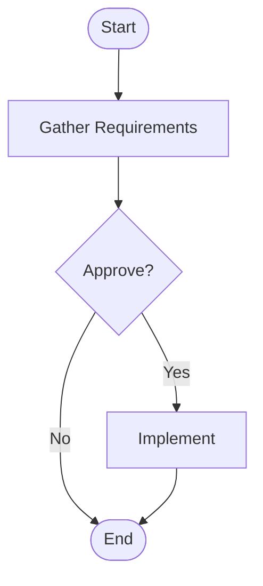

# Business Process Mapping

## Overview
Business process mapping documents how tasks flow across your organization. Clear diagrams reveal inefficiencies, bottlenecks, and opportunities for automation. This guide walks you through creating accurate maps that support continuous improvement.

## Why It Matters
Without a shared view of your processes, teams work from assumptions. Mapping clarifies responsibilities and highlights areas for streamlined collaboration. A well-drawn map helps you reduce waste, set expectations, and maintain quality. It also provides a baseline to measure changes and track improvements.

## Audience, Scope & Personas
Process owners, business analysts, and operations managers use this guide to capture current workflows and design future ones. Team leads may reference maps to train new staff. Executives rely on high-level diagrams to make strategic decisions about resources and investments. The instructions apply to both small projects and large-scale organizational analyses.

## Prerequisites
Gather existing procedure documents and any regulations that influence the process. Identify key roles and responsibilities. Access to diagramming tools such as Visio, draw.io, or Lucidchart is essential. Confirm you have permission to interview team members and review relevant systems.

## Security & Compliance
Process maps can expose sensitive data flows or proprietary steps. Store diagrams in a secure repository with version control. Follow your organization's classification policy when labeling documents. If personal data appears in a map, ensure compliance with GDPR or other applicable laws. Remove or obfuscate confidential details before sharing publicly.

## Tasks & Step-by-Step Instructions
1. **Define Goals.** State why you are mapping the process. Examples include reducing cycle time or ensuring compliance.
2. **Identify Stakeholders.** List everyone who performs tasks or approves outputs. Schedule interviews with them.
3. **Gather Inputs.** Review manuals, previous diagrams, and system logs for baseline information.
4. **Document Current Steps.** Write down each activity in the order it occurs, including decision points and handoffs.
5. **Create a Draft Diagram.** Use a consistent notation such as BPMN. Start with high-level steps, then add detail.
6. **Validate with the Team.** Review the draft with stakeholders to confirm accuracy. Adjust as needed.
7. **Analyze for Improvements.** Look for unnecessary steps, delays, or duplicate work. Mark areas where automation could help.
8. **Publish the Final Map.** Store the approved diagram in a shared location and communicate updates to the team.

## Access Control & Permissions
Restrict edit rights to the process owner or designated analyst. Provide read-only access to broader teams through your document management system. When diagrams cover cross-department workflows, coordinate with department leads to approve access levels. Track version history so you can revert to prior diagrams if needed.

## Examples & Templates
Here is a simple checklist to keep maps consistent:

- ✅ Use standard symbols and color codes so everyone understands the diagram.
- ✅ Include start and end points, decision diamonds, and data stores.
- ✅ Add references to supporting documents for each step.
- ❌ Overload the diagram with low-value details.
- ❌ Skip sign-off from subject matter experts.

You can adapt the template below:

Replace each step with your specific tasks. The template helps you get started quickly.

## Known Issues & Friction Points
- **Incomplete Inputs.** Teams may not have up-to-date procedures. Schedule time to observe tasks directly when documentation is missing.
- **Complex Systems.** Interactions across multiple applications can complicate diagrams. Break large processes into smaller sub-flows to keep them readable.
- **Resistance to Change.** Team members may fear that mapping exposes inefficiencies. Emphasize that the goal is improvement, not blame.

## Tips & Best Practices
- Hold brief interviews with frontline staff to capture real workflows.
- Use version numbers in the file name for easy reference.
- Highlight quick wins that can be automated after mapping.
- Provide training on the chosen diagramming tool so contributors can review and update diagrams themselves.

## Troubleshooting
When diagrams become confusing or contradictory, step back and verify the data sources. Check for missing decision paths or loops that should end. If stakeholders disagree on the flow, host a workshop to reach consensus. Keep minutes and update the map immediately after each session.

## Dependencies & Escalation
Mapping relies on cooperation from departments that own each part of the process. If you cannot gather needed details or if approval stalls, escalate to the process owner or project sponsor. Provide a clear summary of the missing information and how delays impact timelines.

## Success Metrics & Outcomes
Track the number of processes documented and the time required to complete each map. Measure cycle-time reductions or error-rate decreases after implementing improvements. Share metrics with leadership to show the value of ongoing mapping initiatives.

## Resources & References
- [BPMN Specification](https://www.omg.org/spec/BPMN/)
- Internal process libraries and templates
- Example maps from similar projects

## Last Reviewed / Last Updated
2025-08-30 - Codex Team

### Advanced Mapping Techniques
Consider value stream mapping when analyzing end-to-end delivery. This method focuses on value-added versus wasteful activities. Another approach is SIPOC (Suppliers, Inputs, Process, Outputs, Customers), which helps clarify boundaries and dependencies. Choose the technique that best suits your process goals and complexity.

### Expanded Tasks & Step-by-Step Instructions
9. **Identify Decision Criteria.** Document how approvals occur, including who has authority at each decision point.
10. **Map Systems and Data Flows.** Link each task to the supporting applications or data repositories. This helps IT teams understand integration needs.
11. **Capture Metrics.** Note cycle time, wait time, and defect rates for each step so you can benchmark improvements.
12. **Prioritize Improvements.** Work with stakeholders to rank suggested changes based on impact and effort. Document these priorities in a backlog.

### Extended Examples & Templates
Use swimlane diagrams to show roles and handoffs. Each lane represents a person or team. For complex processes, layer diagrams by detail level: start with a high-level overview, then create sub-process maps that drill into specifics. Provide examples of before-and-after states so readers see the benefits of mapping.

### Additional Known Issues & Friction Points
- **Tool Limitations.** Some diagramming software may not support advanced notation. Export diagrams to a standard format like PDF or SVG for broader compatibility.
- **Version Control Conflicts.** When multiple analysts edit a process map, track changes carefully to avoid conflicting versions.
- **Stakeholder Fatigue.** Long mapping sessions can overwhelm participants. Break workshops into short, focused meetings to maintain engagement.

### More Tips & Best Practices
- Keep an issue log alongside your diagrams to capture questions that arise during workshops.
- Reference process numbers or unique identifiers so you can cross-link diagrams to requirement documents.
- Align the level of detail to your audience. Executives often need a summary view, while implementers require deeper detail.

### Additional Troubleshooting Guidance
If stakeholders can't agree on a process step, gather supporting evidence such as logs or metrics to determine the correct flow. When diagrams become cluttered, split them into phases or separate swimlanes. Encourage participants to sketch their own view of the process so you can compare perspectives.

### Expanded Dependencies & Escalation Paths
Mapping often depends on subject matter experts' availability. If they cannot meet, request sample data or process recordings. Escalate to department heads for scheduling conflicts. Document dependencies on external vendors or third-party systems; escalate any blockers to the project sponsor.

### Measuring Success In Detail
Track the time from kickoff to final map approval to gauge efficiency. Survey participants about clarity and usefulness of the diagrams. After implementing improvements, compare new cycle times with baseline metrics. Document cost savings or increased throughput for leadership reports.

### Extra Resources & References
- White papers on Lean Six Sigma for process optimization.
- Tutorials on BPMN best practices.
- Case studies from your industry demonstrating successful process mapping.

### Future Updates
Plan periodic reviews, especially after system upgrades or organizational changes. Process maps quickly become outdated if underlying workflows shift. Encourage team members to submit change requests whenever they spot discrepancies.

## Last Reviewed / Last Updated
2025-08-30 - Codex Team

### Case Study Example
A financial services firm used process mapping to unify customer onboarding across regional teams. Initial diagrams revealed redundant approval loops that added days to account setup. After consolidating steps and automating document collection, cycle time dropped by 30%. Employees reported clearer roles and fewer errors. This example shows the tangible gains that mapping can deliver.

### Ongoing Maintenance
Assign an owner to review each map at least twice a year. Significant changes in regulations, tooling, or staffing warrant immediate updates. Keep revision history so you can track how the process evolves. Encourage team members to submit suggestions whenever they see an outdated step or unclear transition.

## Last Reviewed / Last Updated
2025-08-30 - Shailesh Rawat

Continual refinement of your process maps keeps teams aligned with business objectives and supports long-term improvement.
Stay engaged with stakeholders and review process metrics regularly to ensure maps remain actionable and relevant.
Your commitment to detailed mapping drives efficiency and promotes a culture of transparency.
